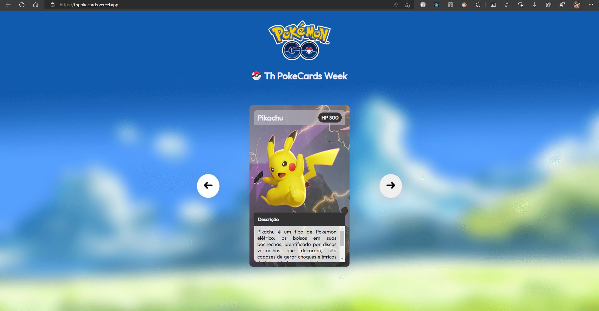
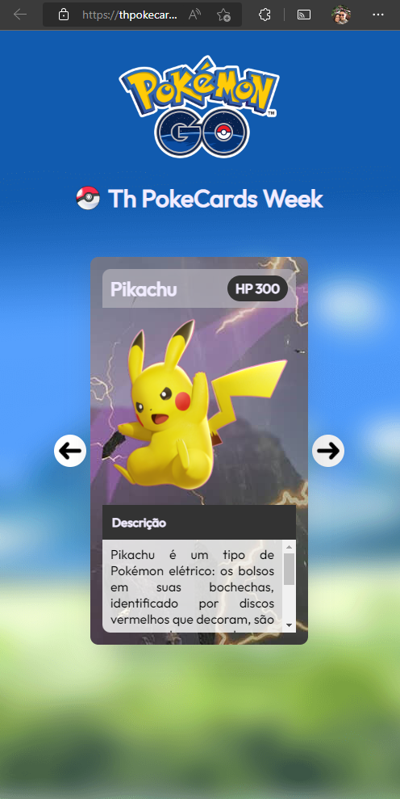

# Th PokeCard Week 💻
## Site desenvolvido com tecnologia ReactJS e TypeScript simulando uma pokédex pokémon, consumindo uma API instanciada no graphCMS.

- Deploy: https://thpokecards.vercel.app/

{: height="36px" width="36px"}

### 🚀 Conhecimentos desenvolvidos
- ReactJS
- React-router-dom
- GraphQL
- GraphCMS
- TypeScript
- ApolloClient
- Vercel

### ⚙️ Funcionalidades
- Lista alguns dos pokémons mais famosos do jogo PokémonGo
- Tras algumas informações importantes sobre esses pokémons 
- Cards estilzados

### 🧩 Incrementos
- Fiz uso das tecnologias ReactJS com typescript 
- Criação e consumo de API no graphCMS
- Ajustes as rotas da vercel

